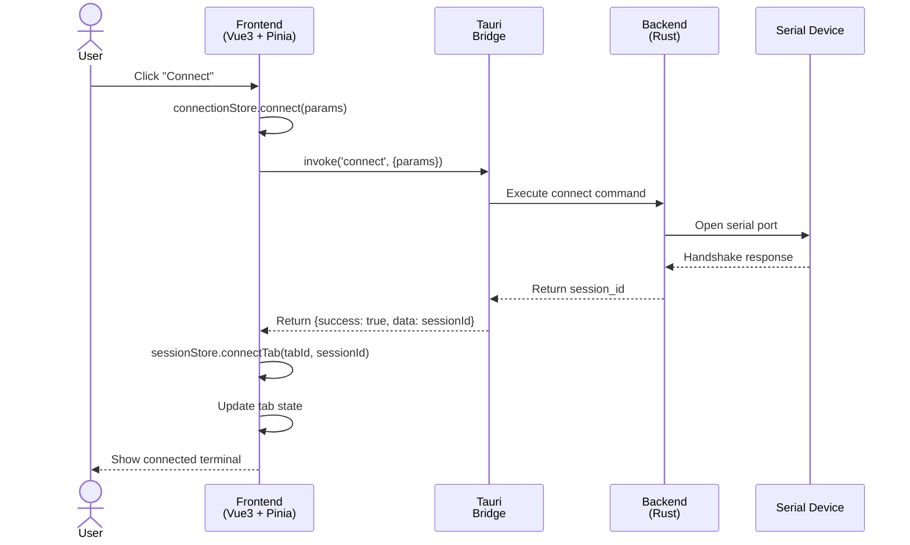
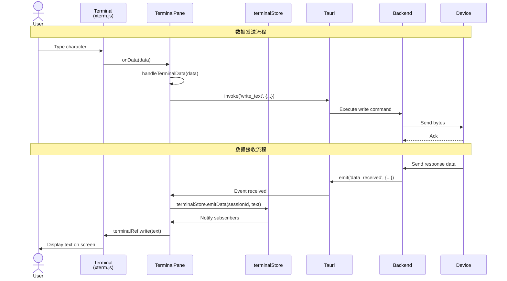

# 后端 IPC 接口规范

## 概述

本文档定义了 embedded-debugger 前端 (Vue3) 与后端 (Rust/Tauri) 之间的 IPC (Inter-Process Communication) 接口规范。

## 设计原则

1. **Tab = Session = Connection (1:1:1 映射)**
   - 一个前端标签页对应一个后端会话
   - 一个后端会话对应一个设备连接

2. **Commands ≠ Events (清晰分离)**
   - Commands: 前端 → 后端（触发操作）
   - Events: 后端 → 前端（通知状态变化）

3. **状态所有权边界**
   - 前端：UI 状态（标签页、搜索、时间戳）
   - 后端：运行时状态（连接、会话、日志）

---

## 命令接口 (Commands)

### 连接管理

#### `connect`
建立设备连接。

**参数:**
```typescript
{
  params: ConnectionParams  // 连接参数
}
```

**返回:**
```typescript
{
  success: boolean
  data?: string        // session_id
  error?: IpcError
}
```

#### `disconnect`
断开设备连接。

**参数:**
```typescript
{
  session_id: string
}
```

**返回:**
```typescript
{
  success: boolean
  error?: IpcError
}
```

#### `get_connection_status`
获取连接状态。

**参数:**
```typescript
{
  session_id: string
}
```

**返回:**
```typescript
{
  success: boolean
  data?: ConnectionStatus  // 'disconnected' | 'connecting' | 'connected' | 'error'
  error?: IpcError
}
```

#### `write_data`
发送原始字节数据到设备。

**参数:**
```typescript
{
  session_id: string
  data: number[]        // Uint8Array as number array
}
```

**返回:**
```typescript
{
  success: boolean
  error?: IpcError
}
```

#### `write_text`
发送文本数据到设备（自动编码为 UTF-8）。

**参数:**
```typescript
{
  session_id: string
  text: string
}
```

**返回:**
```typescript
{
  success: boolean
  error?: IpcError
}
```

### 会话管理

#### `list_sessions`
获取所有会话列表。

**参数:** 无

**返回:**
```typescript
{
  success: boolean
  data?: SessionInfo[]
  error?: IpcError
}
```

#### `get_session_info`
获取单个会话信息。

**参数:**
```typescript
{
  session_id: string
}
```

**返回:**
```typescript
{
  success: boolean
  data?: SessionInfo
  error?: IpcError
}
```

#### `rename_session`
重命名会话。

**参数:**
```typescript
{
  session_id: string
  new_name: string
}
```

**返回:**
```typescript
{
  success: boolean
  error?: IpcError
}
```

### 串口管理

#### `list_serial_ports`
列出可用串口。

**参数:** 无

**返回:**
```typescript
{
  success: boolean
  data?: SerialPortInfo[]
  error?: IpcError
}
```

### 日志管理

#### `start_logging`
开始会话日志记录。

**参数:**
```typescript
{
  session_id: string
  file_path: string
}
```

**返回:**
```typescript
{
  success: boolean
  error?: IpcError
}
```

#### `stop_logging`
停止会话日志记录。

**参数:**
```typescript
{
  session_id: string
}
```

**返回:**
```typescript
{
  success: boolean
  error?: IpcError
}
```

#### `get_logging_status`
获取日志记录状态。

**参数:**
```typescript
{
  session_id: string
}
```

**返回:**
```typescript
{
  success: boolean
  data?: LoggingStatus
  error?: IpcError
}
```

---

## 事件接口 (Events)

### 数据接收事件

#### `data_received`
当从设备接收到数据时触发。

**Payload:**
```typescript
{
  session_id: string
  data: number[]        // Uint8Array as number array
}
```

### 状态变更事件

#### `status_changed`
当连接状态变更时触发。

**Payload:**
```typescript
{
  session_id: string
  status: 'disconnected' | 'connecting' | 'connected' | 'error'
}
```

### 错误事件

#### `error_occurred`
当发生错误时触发。

**Payload:**
```typescript
{
  session_id: string
  error: IpcError
}
```

**IpcError 结构:**
```typescript
{
  code: string          // 错误代码，如 'CONNECTION_FAILED'
  message: string       // 错误描述
  details?: string     // 详细错误信息（可选）
}
```

---

## 类型定义

### 连接参数

```typescript
type ConnectionParams =
  | { type: 'serial' } & SerialParams
  | { type: 'telnet' } & TelnetParams

interface SerialParams {
  port: string
  baud_rate: number
  data_bits: 'seven' | 'eight'
  parity: 'none' | 'odd' | 'even'
  stop_bits: 'one' | 'two'
  flow_control: 'none' | 'software' | 'hardware'
}

interface TelnetParams {
  host: string
  port: number
  connect_timeout_secs: number
}
```

### 连接状态

```typescript
type ConnectionStatus = 'disconnected' | 'connecting' | 'connected' | 'error'
```

### 连接统计

```typescript
interface ConnectionStats {
  bytes_sent: number
  bytes_received: number
  packets_sent: number
  packets_received: number
}
```

### 会话信息

```typescript
interface SessionInfo {
  id: string
  name: string
  connection_type: string
  status: ConnectionStatus
  created_at: string
  last_activity?: string
  stats: ConnectionStats
  logging_enabled: boolean
  log_file_path?: string
}
```

### IPC 错误

```typescript
interface IpcError {
  code: string
  message: string
  details?: string
}
```

---

## 数据流示意图

### 连接流程

```
用户点击 "Connect"
  ↓
ConfigPanel.handleConnect()
  ↓
connectionStore.connect(params)  →  Tauri invoke 'connect'
  ↓
后端建立连接 ←───→ 设备握手
  ↓
后端返回 session_id
  ↓
sessionStore.connectTab(tabId, sessionId)
  ↓
更新标签页状态 (tab.sessionId = session_id)
  ↓
emit('connected', sessionId)
  ↓
ConfigPanel 关闭，显示终端
```

### 数据发送流程

```
用户在终端输入字符
  ↓
Terminal.onData(data)
  ↓
handleTerminalData(data)
  ↓
connectionStore.writeText(sessionId, data)  →  Tauri invoke 'write_text'
  ↓
后端编码文本为 UTF-8 字节
  ↓
后端通过连接发送到设备
  ↓
设备接收数据
```

### 数据接收流程

```
设备发送数据
  ↓
后端从连接读取原始字节
  ↓
后端 emit 'data_received' 事件 {session_id, data: number[]}
  ↓
useTauriEvents 监听事件
  ↓
terminalStore.emitData(session_id, text)  (解码 bytes 为 UTF-8 文本)
  ↓
TerminalPane 订阅收到数据
  ↓
terminalRef.write(text)  →  xterm.js 显示文本
  ↓
终端屏幕更新显示新数据
```

---

## 附录

### A. 错误代码对照表

| 错误代码 | 描述 | 场景 |
|-----------|------|------|
| `CONNECTION_FAILED` | 连接建立失败 | 设备未响应、端口被占用 |
| `CONNECTION_TIMEOUT` | 连接超时 | 设备响应过慢 |
| `DISCONNECTED_UNEXPECTED` | 意外断开 | 设备断电、线缆松动 |
| `WRITE_FAILED` | 写入失败 | 连接已断开、设备缓冲区满 |
| `READ_FAILED` | 读取失败 | 连接已断开、数据损坏 |
| `INVALID_SESSION` | 无效会话 | session_id 不存在或已关闭 |
| `MAX_SESSIONS_REACHED` | 会话数上限 | 超过配置的最大会话数 |
| `PERMISSION_DENIED` | 权限不足 | 串口权限、网络权限等 |

### B. 序列图示例

#### 连接建立流程



#### 数据发送与接收流程



---

**文档版本**: 1.0  
**最后更新**: 2024  
**作者**: embedded-debugger team